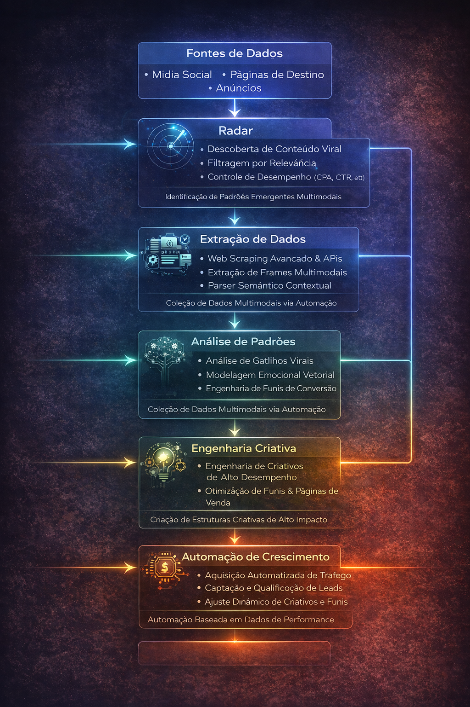

# Marina de Alcantara Andrade

Growth Engineering • Data Systems • AI Applied to Marketing

Construo sistemas que analisam comportamento digital e extraem padrões de crescimento para criar **motores de aquisição e conversão escaláveis**.

Meu trabalho combina engenharia de dados, análise de conteúdo viral, engenharia reversa de marketing e automação para desenvolver sistemas capazes de **identificar, modelar e replicar padrões de crescimento digital**.

---

# Research Focus

Atualmente estou explorando sistemas que combinam:

- análise de padrões virais em conteúdo multimodal
- engenharia emocional aplicada a marketing
- engenharia reversa de funis de vendas
- automação de aquisição baseada em dados
- integração de LLMs em sistemas de growth

O objetivo é compreender **como estruturas narrativas, visuais e emocionais influenciam comportamento digital em escala**.

---

## Arquitetura do Sistema de Crescimento

  

# Systems Architecture

Os projetos que desenvolvo seguem uma arquitetura voltada para **descoberta, análise e engenharia de crescimento digital**.
Data Sources
│
├── Social Media
├── Landing Pages
└── Ads

    ↓
Radar Layer
│
├── Viral Content Discovery
├── Relevance Filtering
└── Performance Gate

    ↓

Extraction Layer
│
├── Frame Extraction
├── Web Scraping
└── Semantic Parsing

    ↓
Analysis Layer
│
├── Viral Triggers
├── Emotional Vectors
└── Conversion Structures

    ↓
Growth Systems
│
├── Creative Engineering
├── Funnel Modeling
└── Marketing Automation

Essa arquitetura permite transformar **dados de comportamento digital em estratégias replicáveis de crescimento**.

---

# Radar System

O **Radar** é o sistema responsável por descobrir conteúdos com potencial viral antes da fase de análise profunda.

Ele atua como um mecanismo de descoberta e filtragem de padrões emergentes.

Principais funções:

- descoberta de conteúdo viral
- coleta automatizada de dados
- filtragem por relevância
- análise inicial de performance
- identificação de padrões emergentes

Pipeline do radar:
keywords → search → relevance gate → performance gate → content pool

O radar alimenta os sistemas responsáveis por **modelar padrões de crescimento digital**.

---

# Core Projects

## Viral Pattern Analysis Engine

Sistema para análise de padrões virais em conteúdos multimodais.

Objetivo: identificar estruturas visuais, emocionais e narrativas que aumentam retenção e engajamento.

Componentes principais:

- frame extraction
- motion analysis
- semantic analysis
- emotional trigger modeling

---
---

## Viral Thumbnail Engineering

Sistema de análise estrutural de miniaturas virais no YouTube.

O projeto explora como thumbnails de alto desempenho utilizam **arquitetura visual, arquétipos emocionais e estruturas narrativas** para capturar atenção e aumentar a taxa de clique.

A análise é baseada em um modelo chamado **VDNA (Visual DNA)**, que decompõe thumbnails em múltiplas camadas estruturais.

Componentes analisados:

- composição cinematográfica
- hierarquia visual
- iluminação e atmosfera
- símbolos narrativos
- vetores emocionais

O sistema também extrai **estruturas invisíveis dos títulos**, identificando padrões recorrentes que estimulam curiosidade e promessa narrativa.

Após a análise, os padrões identificados são convertidos em **templates criativos reutilizáveis**, permitindo gerar novas thumbnails mantendo os mesmos vetores de atenção.

Projeto:

analise-de-miniaturas-virais-do-youtube

## Sales Page Reverse Engineering

Projeto de análise estrutural de páginas de vendas de alto ticket.

Utiliza o **Framework FAVE** para decompor elementos como:

- vetores emocionais
- segmentação psicológica
- arquitetura narrativa
- coerência multimodal entre anúncio e página

Objetivo: entender **como estruturas emocionais e narrativas influenciam conversão**.
O FAVE também é utilizado em sistemas de análise de conteúdo viral, como no projeto de engenharia de miniaturas do YouTube.
---

## Marketing Automation Infrastructure

Infraestrutura automatizada para aquisição de tráfego e análise de dados.

Arquitetura baseada em:

- n8n
- APIs externas
- web scraping
- pipelines de dados
- automação de aquisição

---

# Case Studies

## YouTube Organic Growth

Análise de padrões de retenção e gatilhos virais em conteúdo educativo.

Projeto:
case-youtube-crescimento-organico-croche

---

## Instagram Organic Growth

Estudo de consistência visual, narrativa e gatilhos emocionais aplicados a conteúdo artesanal.

Projeto:
case-instagram-crescimento-organico-croche

---

# Frameworks

## FAVE Framework

Framework utilizado para análise vetorial emocional aplicada a marketing e conteúdo viral.

Componentes:

F — Visual DNA  
A — Narrative Archetypes  
V — Emotional Vector  
E — Multimodal Coherence  

Esse framework permite analisar como elementos visuais, emocionais e narrativos influenciam comportamento do usuário.

---

# Technology Stack

Principais tecnologias utilizadas nos projetos:

- Python
- Web Scraping
- LLMs
- Data Engineering
- APIs
- Marketing Automation
- Multimodal Content Analysis

---

# Featured Repositories

1. engenharia-reversa-paginas-vendas  
2. viral-pattern-analysis-engine  
3. case-youtube-crescimento-organico-croche  
4. case-instagram-crescimento-organico-croche  
5. marketing-contingencia-n8n-firecrawl-docker

---

# Mission

Desenvolver sistemas que transformem **dados comportamentais em estratégias replicáveis de crescimento digital**.

Isso inclui:

- análise algorítmica de conteúdo
- engenharia de sistemas de aquisição
- modelagem emocional aplicada a marketing
- automação baseada em dados

## GitHub Stats

